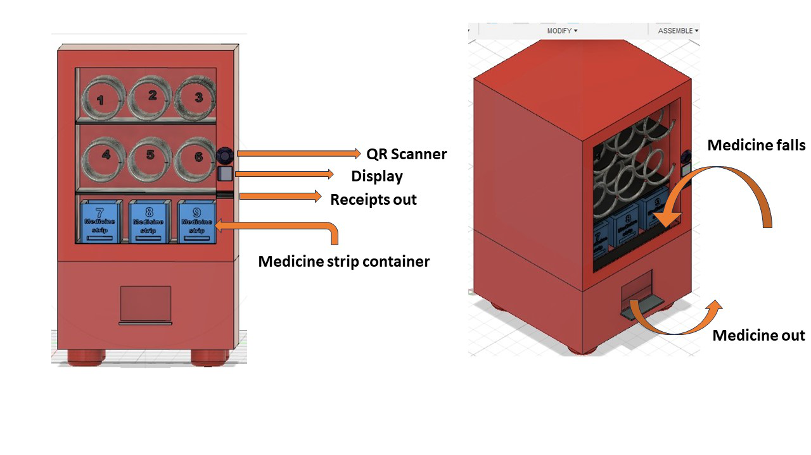
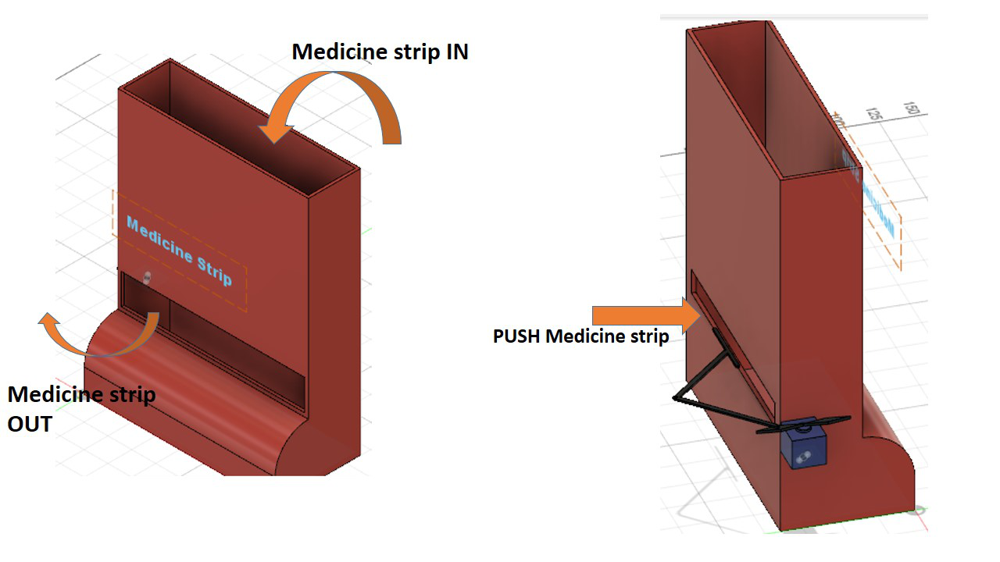

# Automatic Drug Dispenser

The Drug Dispensing Machine is an automated system designed to medication dispensing process, reduce waiting times, and enhance patient safety in healthcare settings.

# Features

- Automated prescription verification with QR code scanning.
- Customizable medication dispensing for various forms of medications.
- Real-time inventory management and stock tracking.
- User-friendly interfaces for healthcare providers and patients.
- Integration with electronic health records (EHRs) for accurate prescription data.
# Technology Stack

- **Microcontroller:** ESP32 board for core system processing.
- **Medication Dispensing Mechanism:** Automated systems for various medication types.
- **QR Code Scanner:** DE2120 2D barcode scanner module for prescription verification.
- **User Interface:** OLED display for clear instructions and transaction information.
- **Control Systems:** Custom control software for efficient operation.

## How does it work??
See this tutorial vedio...

.

## Authors

- [@ArpitMourya](https://github.com/ArpitMourya)
- [@Sourabh Singh](https://github.com/SourabhSingh07)

